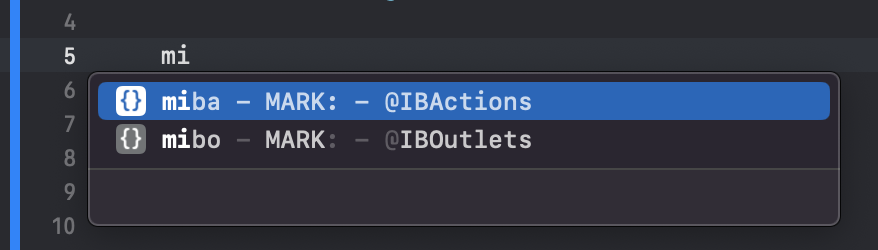
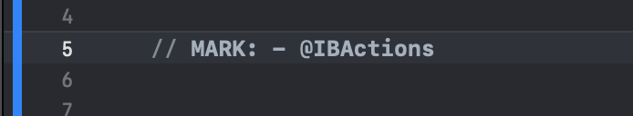

# Xcode-snippets
 This repository contains the most used snippets

# Installation

## Copy this command in terminal and run:

```Shell
git clone https://github.com/VladYankovenko/Xcode-snippets
cp Xcode-snippets/MARKS/*.* Library/Developer/Xcode/UserData/CodeSnippets
rm Xcode-snippets
```

# Available Snippets

```Swift
// MARK: - Events
    
// MARK: - Constants

// MARK: - @IBActions

// MARK: - @IBOutlets

// MARK: - Properties

// MARK: - Private Properties

// MARK: - Init
    
// MARK: - Lifecycle

// MARK: - Actions

// MARK: - Methods

// MARK: - Private Methods
```

# Usage

## Step 1


## Step 2



